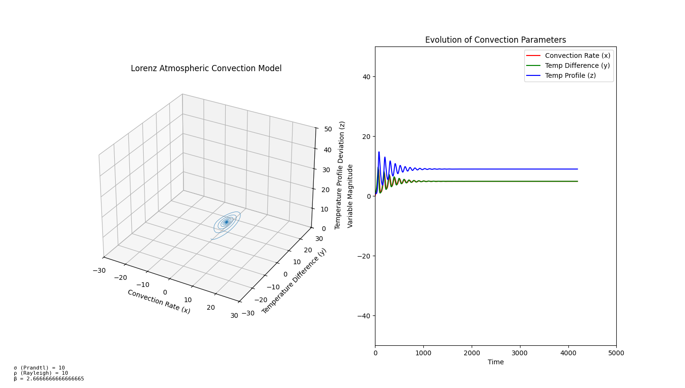
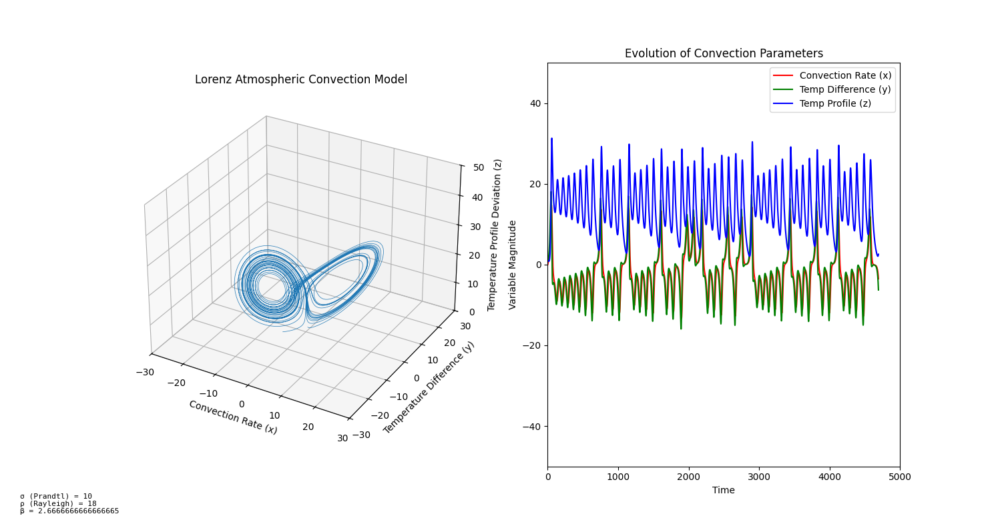
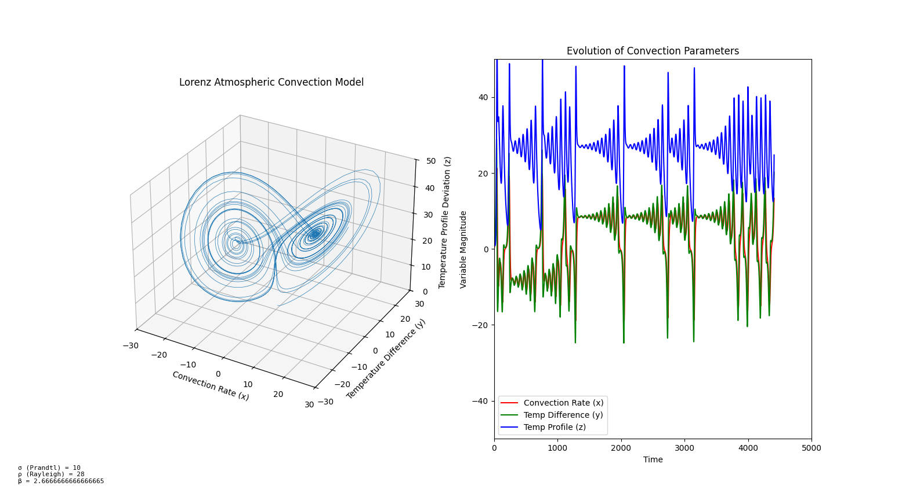
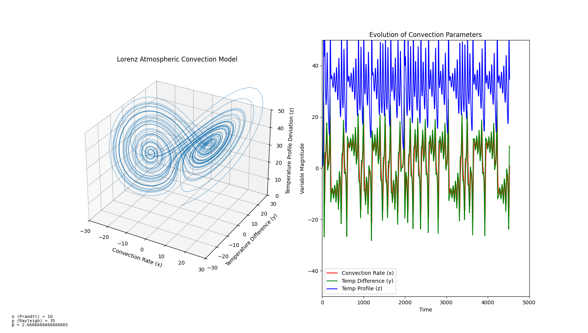

# Chaos and Complexity Playground

A collection of Python simulations and visualizations exploring classic chaos theory and complexity science phenomena.

## Simulations

### Lorenz Attractor

The famous Lorenz system of differential equations that models atmospheric convection and demonstrates chaotic behaviour (the "butterfly effect"). Explore different Rayleigh number (rho) values to see stable, transient, and chaotic regimes.

| Stable (rho=10) | Transient (rho=18) | Chaos (rho=28) | Strong Chaos (rho=35) |
|---|---|---|---|
|  |  |  |  |

See [lorenz_equations_explanation.md](lorenz_equations_explanation.md) for a detailed walkthrough of the physics and mathematics.

### Mandelbrot Set

Computes the Mandelbrot fractal by iterating z = z^2 + c across a complex plane grid, producing iteration-count arrays for visualization.

### Boids Flocking

Craig Reynolds' Boids algorithm with three classic behaviours — separation, alignment, and cohesion — rendered in 3D using PyOpenGL. Boids are colour-coded by proximity: red = crowded, green = comfortable spacing, yellow = isolated.

## Project Structure

```
src/
  simulations/
    lorenz.py          # Lorenz attractor computation
    boids.py           # Boids flocking computation
  fractals/
    mandelbrot.py      # Mandelbrot set computation
examples/
  plot_lorenz.py       # Lorenz animated 3D plot
  plot_mandelbrot.py   # Mandelbrot visualization
  run_boids.py         # Boids 3D flocking simulation
tests/                 # Characterization tests for all simulations
images/                # Sample output images
```

Computation modules in `src/` are pure — no visualization, no side effects. Visualization lives in `examples/`, which imports from `src/`.

## Getting Started

### Dependencies

- Python 3.12+
- NumPy
- Matplotlib (Lorenz, Mandelbrot)
- Pygame + PyOpenGL (Boids)
- pytest (tests)

### Run the Simulations

```bash
# Lorenz attractor (animated 3D plot)
python examples/plot_lorenz.py

# Mandelbrot set
python examples/plot_mandelbrot.py

# Boids flocking (3D OpenGL)
python examples/run_boids.py
```

### Run the Tests

```bash
python -m pytest tests/ -v
```

## Development

All code was developed using Test-Driven Development (red-green-refactor). Characterization tests follow Michael Feathers' methodology from *Working Effectively with Legacy Code* — they document actual behaviour with specific numerical assertions, making refactoring safe.
