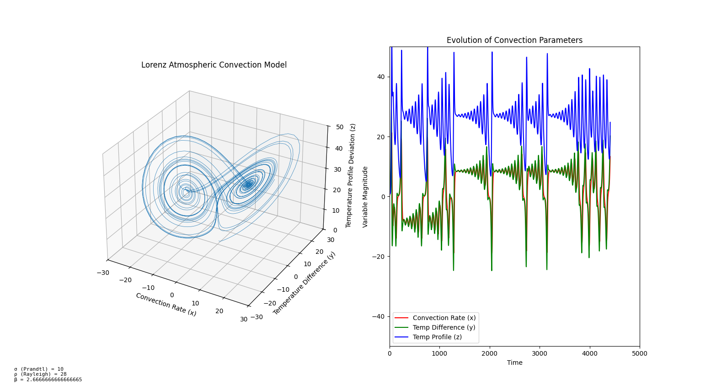
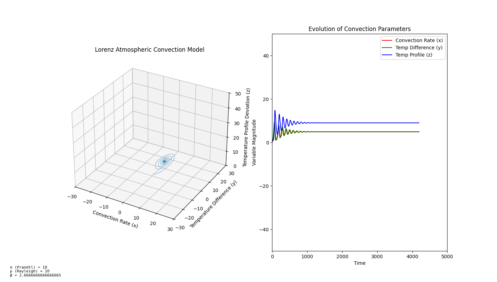
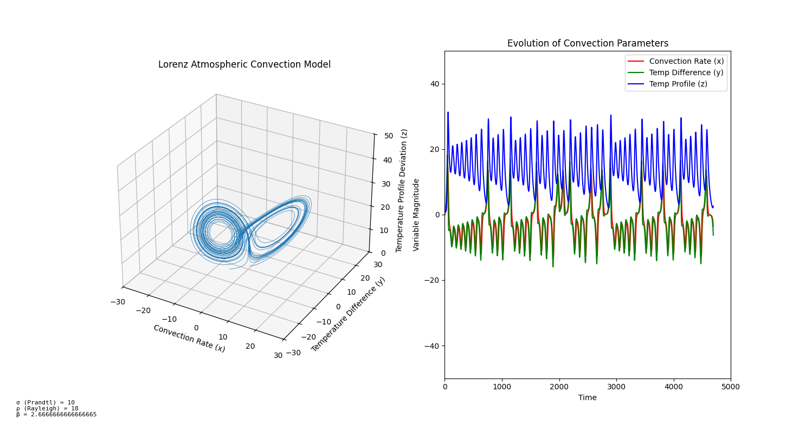

# The Lorentz Attractor

## Background
The Lorenz equations originated from Lorenz's simplified model of atmospheric convection (specifically, Rayleigh-Bénard convection). Here's what each variable represents:

x - Represents the rate of convective overturning (the intensity of convection motion). Specifically, it represents the velocity of circular fluid motion - imagine a roll of rising warm air and sinking cool air.

y - Represents the temperature difference between the ascending and descending currents. When y is positive, it means the rising air is warmer than the descending air (which is what you'd expect in normal convection).

z - Represents the deviation of the vertical temperature profile from linearity. In other words, how much the temperature varies from a steady linear increase with height. High z values indicate the temperature profile is very different from a simple linear gradient.

The parameters also have physical meanings:
- σ (sigma) is the Prandtl number - the ratio of momentum diffusivity to thermal diffusivity
- ρ (rho) is the Rayleigh number - a measure of how strong the heating from below is compared to the dampening effects of viscosity and thermal conductivity
- β (beta) relates to the physical dimensions of the system

What's fascinating is that Lorenz discovered chaos while using these equations to study weather predictability. He found that tiny changes in initial conditions would lead to completely different weather patterns - what we now call the "butterfly effect." The shape of the attractor itself is sometimes called the "butterfly attractor" because its shape resembles butterfly wings, though this is coincidental to its meteorological origins!

## The Physics
The equations model Rayleigh-Bénard convection - a simplified model of atmospheric convection where a fluid layer is heated from below (like the Earth's surface heating air) and cooled from above. Here's how each term in the equations represents physical processes:

1. dx/dt = σ(y - x)
- This equation describes the momentum of the convective motion
- When y > x, the temperature difference drives stronger convection
- σ (Prandtl number) determines how quickly the fluid motion responds to temperature differences
- Think of it as the "inertia" of the convective roll

2. dy/dt = x(ρ - z) - y
- This describes how temperature differences evolve
- ρ (Rayleigh number) represents the basic temperature gradient driving convection
- The -z term shows how the actual temperature profile reduces this driving force
- The xy term represents how convection itself affects temperature differences
- The -y term represents thermal dissipation

3. dz/dt = xy - βz
- This tracks how the temperature profile deviates from linear
- xy represents how convection distorts the temperature profile
- -βz represents how thermal diffusion tries to smooth out these distortions

The key insight from Lorenz was that these three simple equations, representing basic atmospheric physics, could produce chaos. Even though the underlying physics is deterministic, tiny changes in initial conditions lead to completely different outcomes - making long-term weather prediction inherently difficult.

The key differences from stellar convection are:
1. This is a highly simplified 2D model (one convective roll)
2. There's no radiation transport term (unlike in stars)
3. The temperature gradients are much smaller than in stars
4. The equations focus on a single layer rather than the full convection zone

Values below a critical point (~24.74) should lead to stable convection, while higher values (like 28) lead to chaos.

## Observations
### Why do 'Convection Rate (x)' and 'Temp Difference (y)' appear to be coupled?
Q: It appears that 'Convection Rate (x)' and 'Temp Difference (y)' move together but not z? Can x and y ever deviate from each other?

This is a fascinating aspect of the Lorenz system. Looking at the equations:

1. dx/dt = σ(y - x)
2. dy/dt = x(ρ - z) - y
3. dz/dt = xy - βz

The x and y variables are tightly coupled but in an interesting way:
- In the first equation, x is always trying to "catch up" to y (with speed controlled by σ)
- In the second equation, y's behavior depends on both x and z
- The z equation then couples back into y's behavior through the second equation

The apparent synchronization you're seeing between x and y is because of this tight coupling through σ (which in your case is 10). However, they do actually deviate from each other - if you look carefully at your time series plot, the red (x) and green (y) lines aren't exactly in phase. Their relationship is more like a predator-prey relationship with a very short lag.

The z coordinate behaves differently because it represents the convection strength in the original meteorological system Lorenz was modeling. It tends to increase when x and y have the same sign (because of the xy term in its equation) and decrease otherwise (due to the -βz term). This is why z oscillates at roughly half the frequency of x and y - it peaks when x and y are aligned and dips when they're opposed.

Would you like to explore this relationship further? We could create phase space plots of x vs y to better visualize how they interact, or modify σ to see how it affects their coupling.

### The Lorenz system's behavior under different Rayleigh numbers (ρ)
Here's a summary of what we observed in our exploration of the Lorenz system's behavior under different Rayleigh numbers (ρ):

The Rayleigh number (ρ) represents the strength of the temperature gradient driving convection - essentially how strongly we're heating the fluid from below. It's a dimensionless number that compares buoyancy forces (which drive convection) to viscous forces (which resist flow) and thermal diffusion.

#### Case Studies

ρ = 10 (Stable Convection):
- System quickly settles to a single fixed point
- Both time series and 3D plot show initial oscillations that dampen out
- Represents steady, stable convection in one direction (like gentle heating)
- The final state has constant values for convection rate, temperature difference, and profile
- Physically similar to smooth, laminar convection in a gently heated fluid

ρ = 18 (Transient Chaos):

- Shows chaotic behavior initially but theoretically should eventually stabilize
- System exhibits "transient chaos" - unstable enough to show complex behavior
- Sits in an interesting regime between stability and true chaos
- Takes a very long time to settle into one of its stable states
- Physically represents a transitional state between orderly and turbulent convection

ρ = 35 (Strong Chaos):

- Exhibits vigorous, sustained chaos
- Larger "butterfly wings" in the attractor plot
- More erratic and higher amplitude oscillations in all variables
- System never settles into any regular pattern
- Physically represents turbulent convection with unpredictable switching between circulation patterns
- Similar to vigorously boiling water with chaotic circulation patterns

This progression shows how increasing the temperature gradient (ρ) drives the system from orderly behavior through transitional states into full chaos. It's a beautiful example of how a simple deterministic system can produce incredibly complex behavior just by changing one parameter.
